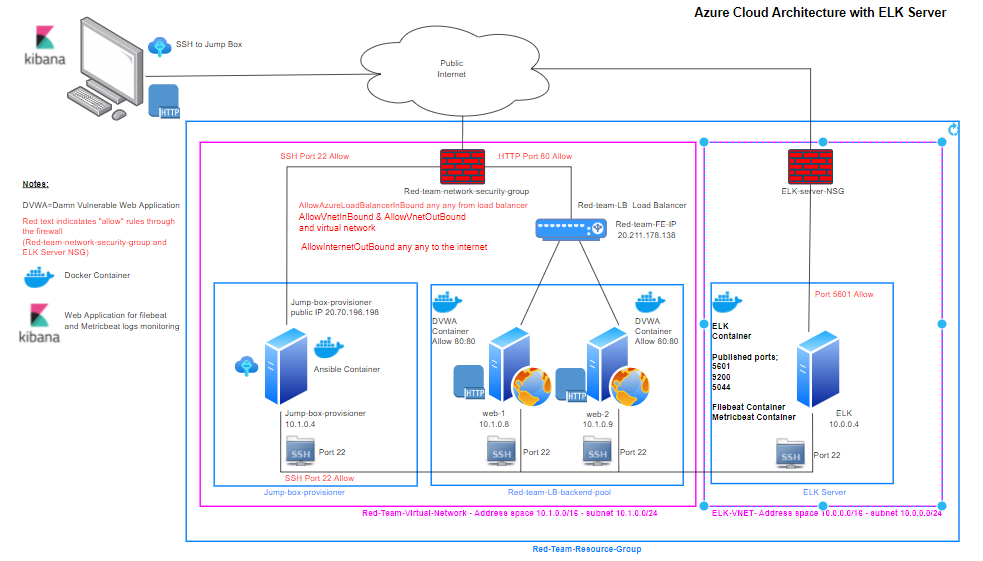
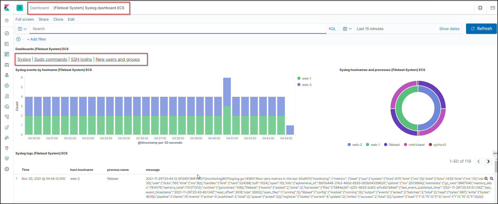

# Project1 - ELK Server

## Overview

ELK server is a server used for collecting log data.  There are three components which make up the acronym:
- Elasticsearch - Indexing and storage.
- Logstack - Data aggregation and processing.
- Kibana - Analysis and visualisation.

Additionally "Beats" adds data collection capability.  This project has added filebeat and metricbeat to the data collection repository


## Prerequsites

Prior to deploying the ELK Server the ANSIBLE Container must be installed on the Jump Box as per the ansible install document. 

[ansible_Install](/Ansible/Ansible-Install.md)

Likewise the web servers should be installed

[Web Install](/Ansible/Web-Install.md)

Once completed, perform the following:

- Run Git Bash as administrator
- SSH to Jump Box using GIT BASH - ssh username@jumpbox public IP address
- sudo docker start [container_name]
- sudo docker attach [container_name]
- Now connected to ansible container shell.
- Navigate to /etc/ansible
- Edit ansible.cfg and hosts files, as follows:
```
### Edit Hosts file
 - edit the hosts file and add the following lines:
 
```[webservers]```

10.1.0.8 ansible_python_interpreter=/usr/bin/python3
10.1.0.9 ansible_python_interpreter=/usr/bin/python3

```[elk]```

10.0.0.4 ansible_python_interpreter=/usr/bin/python3

```[filebeat]```

127.0.0.1
```
### Edit Ansible.cfg File


## Automated ELK Stack Deployment

The files in this repository were used to configure the network depicted below.



These files have been tested and used to generate a live ELK deployment on Azure. They can be used to either recreate the entire deployment pictured above. Alternatively, select portions of the Ansible file may be used to install only certain pieces of it, such as Filebeat.


## ELK Server Ansible Playbook
  ```diff
  ---
- name: Configure Elk VM with Docker
  hosts: elk
  remote_user: cspencer
  become: true
  tasks:
  # Use apt module
  - name: Install docker.io
    apt:
      update_cache: yes
      force_apt_get: yes
      name: docker.io
      state: present
   # Use apt module
  - name: Install python3-pip
    apt:
      force_apt_get: yes
      name: python3-pip
      state: present
   # Use pip module (It will default to pip3)
  - name: Install Docker module
    pip:
      name: docker
      state: present
   # Use command module
  - name: Increase virtual memory
    command: sysctl -w vm.max_map_count=262144
   # Use sysctl module
  - name: Use more memory
    sysctl:
     name: vm.max_map_count
     value: 262144
     state: present
     reload: yes
   # Use docker_container module
  - name: download and launch a docker elk container
    docker_container:
      name: elk
      image: sebp/elk:761
      state: started
      restart_policy: always
    # Please list the ports that ELK runs on
      published_ports:
      - 5601:5601
      - 9200:9200
      - 5044:5044
   # Use systemd module
  - name: Enable service docker on boot
    systemd:
      name: docker
      enabled: yes
```
This document contains the following details:
- Description of the Topology
- Access Policies
- ELK Configuration
  - Beats in Use
  - Machines Being Monitored
- How to Use the Ansible Build


### Description of the Topology

The main purpose of this network is to expose a load-balanced and monitored instance of DVWA, the D*mn Vulnerable Web Application.

Load balancing ensures that the application will be highly ```Available```, in addition to restricting ```Access``` to the network.
- Load Balancers assist with Denial of Service attacks by spreading the traffic over several servers. Likewise a jump box allows secure access to the network through a single point of access which is easily auditable and easy to manage access.

Integrating an ELK server allows users to easily monitor the vulnerable VMs for changes to the ```file nmaes``` and system ```configuration```.
- ```Filebeat monitors system logs```
- ```Metricbeat monitors and reports on system metrics```

Servers associated with this cloud network.

| Name    | Function   | IP Address | Operating System |
|---------|------------|------------|------------------|
| Jumpbox | Jump Host  | 10.1.0.4   | Linux            |
| web-1   | Web Server | 10.1.0.8   | Linux            |
| web-2   | Web Server | 10.1.0.9   | Linux            |
| ELK     | ELK Server | 10.0.0.4   | Linux            |

### Access Policies

The machines on the internal network are not exposed to the public Internet.  This is achieved by ensuring the internal network is on its own private subnet and also the Network Security Group denys ALL except for SSH and one addressable workstaion with http allow. 

Only the ```Jump Box``` machine can accept connections from the Internet. Access to this machine is only allowed from the following IP addresses:
- 20.70.196.198

Machines within the network can only be accessed by ```SSH from the Jump Box```.
- The ELK VM is accessable from the internal network via SSH from IP addresss 10.1.0.8 , 10.1.0.9, and 10.1.0.4

A summary of the access policies in place can be found in the table below.

| Name |  Publicly Accessible   | Allowed IP Addresses | Control |
|---|---|---|---|
| Jump Box  internal | No | 10.1.0.4 | Security Group Policy and SSH |
| Jump Box Public | Yes | 1.123.42.152 | Security Group Policy and SSH |
| HTTP | Yes | 1.123.42.152 | Security Group Policy |
| ELK | No | 10.0.0.0/24 | Security Group Policy and SSH |
| ELK Public - Kabana | Yes | 1.123.42.152 | Security Group Policy and Port 5601 allow |


### Elk Configuration

Ansible was used to automate configuration of the ELK machine. No configuration was performed manually, which is advantageous because...
- The advantage of using ansible to configure the servers is that it is a series of commands in a small fill (YAML) which is easily editable and can be transported to other systems for identicla results.

The playbook implements the following tasks:

- Install Docker.io
- Install Python PIP-3
- Install Python Module for Docker 
- Increase Memory
- Download and install ELK container sebp/elk:761
- Publish elk ports
      - 5601:5601
      - 9200:9200
      - 5044:5044
- name: Enable service docker on boot
   

The following screenshot displays the result of running `docker ps` after successfully configuring the ELK instance.


### Target Machines & Beats
This ELK server is configured to monitor the following machines:
```
- web-1 10.1.0.8
- web-2 10.1.0.9
```
We have installed the following Beats on these machines:
- Filebeat
- Metricbeat

These Beats allow us to collect the following information from each machine (see following Kibana samples):
- filebeat captures log files, such as /etc/passwd file for identifying new users and groups, syslogs.
- Metricbeat captures system metrics such as memeory usage, CPU usage

## Filebeat Kibana Display
#


#
### Metricbeat Kibana Dispaly

#


### Using the Playbook
In order to use the playbook, you will need to have an Ansible control node already configured. Assuming you have such a control node provisioned: 

SSH into the control node and follow the steps below:
- Copy the ```Ansible YAML ELK_Install.yml ```file to ```/etc/ansible```.
- Update the ```ansible hosts``` file to include```[elk]10.0.0.4```
- Run the playbook, and navigate to ```[elk public IP]:5601/app/kibana#/home``` to check that the installation worked as expected.

